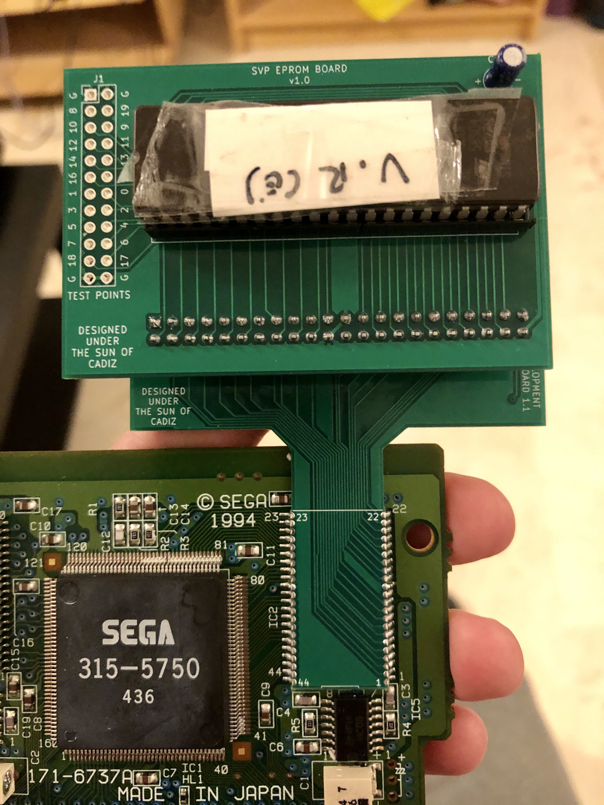

# SVP Development Boards

Here you can find the boards that I've used so far in order to develop code for the SVP chip. Additional boards are in the development with the idea of making development on the real SVP more accessible for developers.

All boards were designed with KiCAD 5.1.

## Boards

- **svp-adapter-board**: the main board in this project. It's designed to be a substitution of the original ROM chip in the Virtua Racing cartridge, exposing the ROM pins in an accessible way so other boards can be plugged to it.
- **svp-eprom-board**: a simple board that plugs into `svp-adapter-board` and allows to feed code to the SVP from a 2MB EPROM (or a pin-compatible EEPROM).
- **rom-access-board**: kept here for documentation purposes. This is the first board I designed, intended to dump the original ROM chip in my copy of Virtua Racing and thus confirm the pinout to be able to design the other ones.

## Future boards

Developing using EPROMS is **painfully slow**. Current work in this part of the project involves the design of additional boards that allow faster and more iterative ways to feed code into the SVP chip: from an FPGA (using BRAM or SDRAM as memory storage), and a cartridge slot (so that a flash cartridge could be used to feed data to the SVP - this would be the preferral way for current Mega Drive/Genesis developers I guess). Once they're ready and tested I'll post them here.

## Compatibility

These boards have only been tested with a European copy of Virtua Racing. I haven't had the chance to try these on other regions versions, but as they depend on the ROM chip pins my guess is that they should work OK in those cases too.

## Manufacturing (and a warning)

Most of these boards are fairly simple to manufacture and any of the usual services used by hobbyists will do. The only board I've had issues with is the `svp-adapter-board`, as it requires fairly precise castellated holes and the layout of the board doesn't allow for much space around them. Each of the boards has its own README containing manufacturing/mounting information if required.

### Warning

I'm a hobbyist and currently I'm actually learning PCB design (and soldering, etc...) on my own while working on this project. That means that these boards aren't made by a proper electronics engineer and probably could be better designed. I've assumed the risks to try these out with my own hardware knowing that something could go wrong, so that goes for anyone trying these out too. I can't be hold responsible if something breaks while playing with these (even if they're fairly simple and don't contain any potentially hazardous components). The risks are small but they are there.

That being said, it's really fun! You should try it! :D

## License

The designs for these boards is open source and MIT-licensed. Also take into account the following conditions of use:

* Please use these tools for good. Also for fun. But good fun, not evil fun.
* Messing with real hardware is risky. By using these boards you are responsible for any potential issues you might find while using these designs.
* If you build something really cool (moderately cool also works for me) using these boards please drop a comment at `taiyou[at]gmail.com`.
* You're not forced, but if you use these boards in your own projects I'd appreciate if you could acknowledge me :).

## "Designed under the sun of Cadiz"

You'll find that most of my boards here have this text somewhere in their layout. I was born in [Cádiz](https://en.wikipedia.org/wiki/C%C3%A1diz), the southernmost city in Spain (and the oldest city in Western Europe). It's not a city that's usually associated to technology or these kind of projects so for me it's really important that *cool* things some of us do here related to tech are considered as part of the legacy of this town too. These designs are open source so you're free to modify them at your will, but I'd ask you kindly not to remove this label if you will. Please help us to spread the name of our wonderful city all around the tech world!