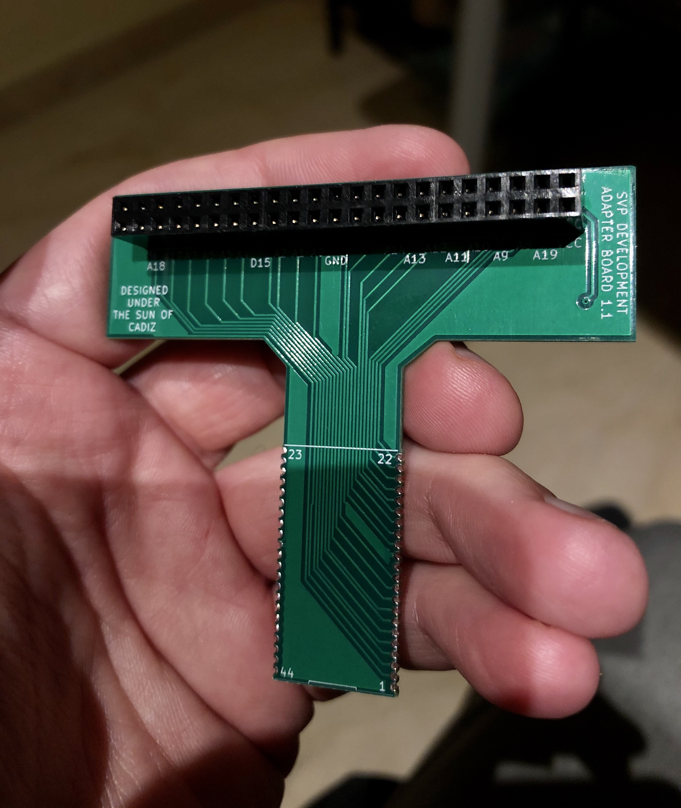
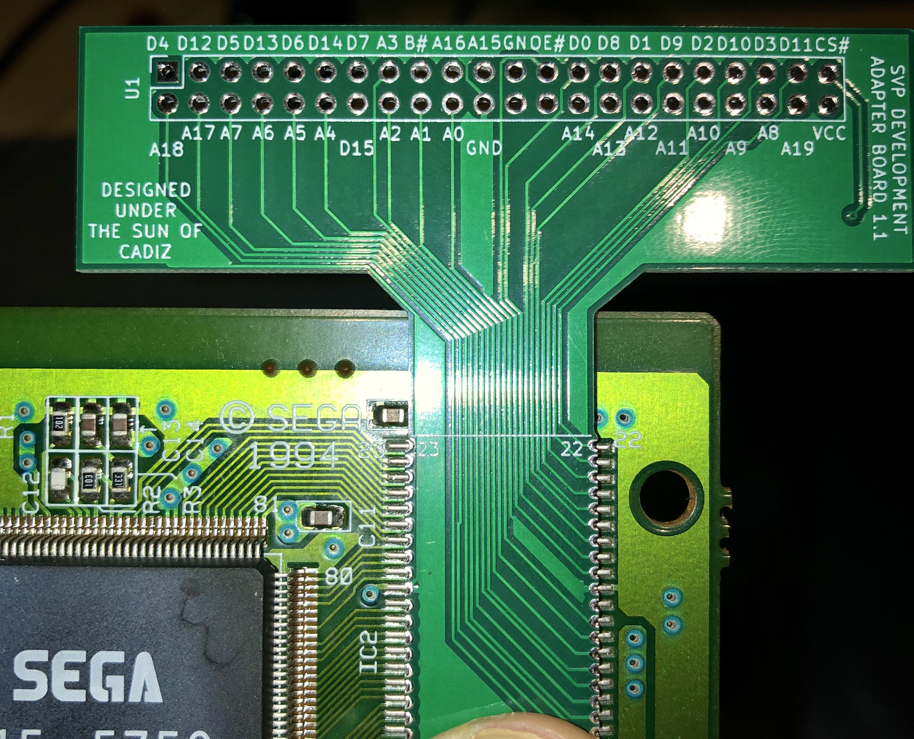
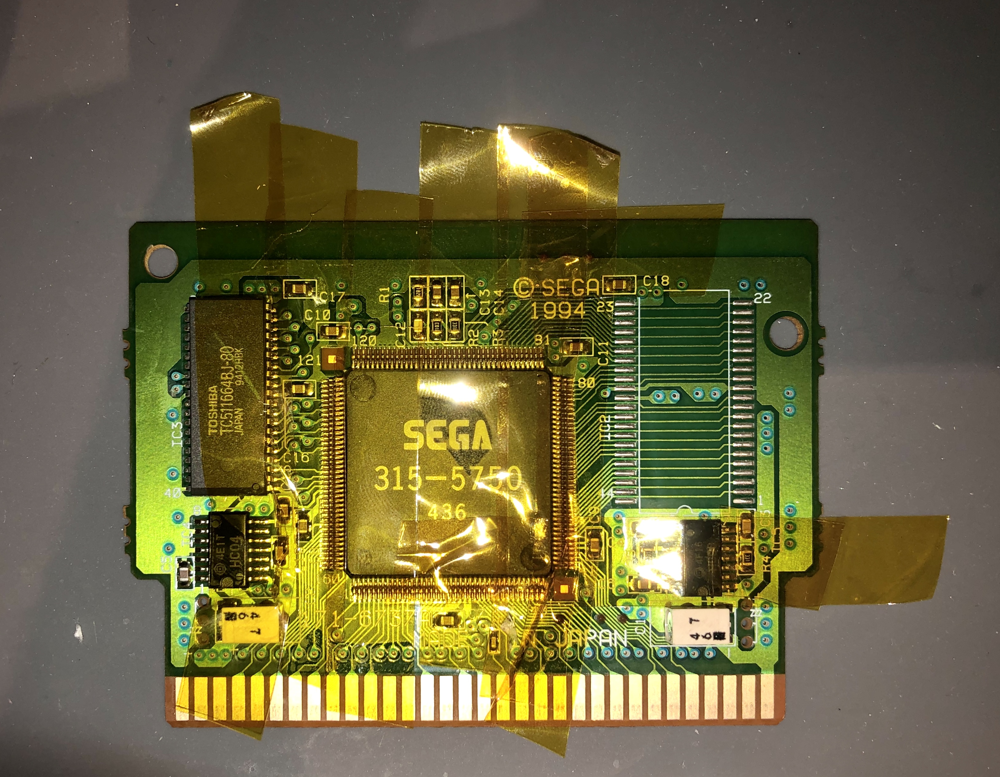
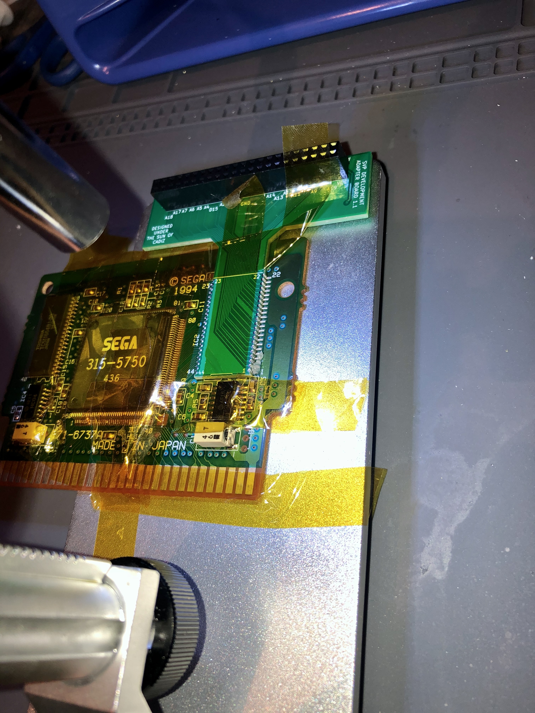

# SVP adapter board

This board is the main design for this project, creating an interface between the SVP chip and external devices that could feed code to it.

Designed with KiCAD 5.1.

## Components

The board itself only has a component: a 44-pin female connector, with the idea of allowing flexibility to connect different code sources to the chip.

## Manufacturing

If you want to order this board to your manufacturer, please take the following into account:

- Note that the board requires the use of **half-plate holes** (also known as **castellated holes**). These allow the board to be positioned over the original ROM pins in the cartridge board (once the ROM chip is desoldered) and be soldered to them. Most manufacturing sites require that you check an option for these during the price calculation phase of the purchase, and not doing so (to save some bucks) has the risk that the board won't be manufactured correctly.

- Some manufacturers have really strict requirements for castellated holes. This board fulfills most of the advertised ones in the sites I saw, but then had issues with some of them as their process had other limitations that weren't public. i.e.: JLCPCB can't build this board (at least on their normal process) as they required 3 mm of board below the castellated holes to hold the board in place while they're drilling them (and thus couldn't fit the actual space in the cartridge itself). PCBWay worked well for me (note: I'm in no way sponsored by them) and I'm sure other manufacturers won't have any issues with this board either.

## Mounting

The board is designed to fit where the ROM chip is in the Virtua Racing cartridge, and the corner pins are marked to fit the ones in the cartridge itself. Please note that:

- This board **replaces** the ROM chip in the Virtua Racing catridge, so you need a way to take the ROM chip apart beforehand. I used *ChipQuik* (a mixture of tin and bismuth) that allows desoldering the chip more or less easily, but I also didn't want to destroy the ROM chip in the process. Hot air soldering guns could also be used for this, but I'd take care with the rest of the board (maybe use hi-temp masking tape to protect the rest of the board).

- I measured the pins as best as I could but the holes aren't 100% perfectly aligned, probably some tenths of a milimiter per pin and maybe as a result of the manufacturing process. That means that you're gonna have to take care on how the board fits to be sure that the contacts of each castellated holes' edge can be soldered well enough to the ROM pins. Not all pins are required: pins 1 and 44 aren't connected to the SVP, so you can take less care with these (I just used them to hold the board into place once I knew the rest of the pins were more or less aligned). See the alignment more or less here:

- I'm not an expert in soldering at all, but I'd recommend using a soldering station that has temperature control for this. Also a thin soldering tip for SMD work. I don't think I'd been able to solder this board successfully without one! I also made use of a cheap USB microscope to verify the solderings and check for possible bridges. Here are some pictures of the process I followed:

Notice the desoldered ROM chip at the right side, and the hi-temp masking tape all around the cartridge (to avoid accidents, possible small particles of tin falling on the SVP contacts...). It's probably a bit overkill but for good measure in my case :).

Here you can see how I soldered this to the cartidge after aligning and using some hi-temp masking tape to keep it stable. I used the base of an USB microscope to hold the whole thing together so I could inspect the contacts easily from time to time.

Here's the final result (with the [EPROM board](../rom-access-board) attached to it). Note that the pitch in the ROM pins (1.27 mm.) is fairly forgiving for this kind of work, you just need to get used to soldering the castellated holes. I found that going from the pins to the hole with the soldering tip made it really easy for me, but if you haven't done this in the past take a look at some YouTube tutorials (plenty around) before attempting this.

## License

The designs for these boards is open source and MIT-licensed. Also take into account the following conditions of use:

* Please use these tools for good. Also for fun. But good fun, not evil fun.
* Messing with real hardware is risky. By using these boards you are responsible for any potential issues you might find while using these designs.
* If you build something really cool (moderately cool also works for me) using these boards please drop a comment at `taiyou[at]gmail.com`.
* You're not forced, but if you use these boards in your own projects I'd appreciate if you could acknowledge me :).

## "Designed under the sun of Cadiz"

You'll find that most of my boards here have this text somewhere in their layout. I was born in [Cádiz](https://en.wikipedia.org/wiki/C%C3%A1diz), the southernmost city in Spain (and the oldest city in Western Europe). It's not a city that's usually associated to technology or these kind of projects so for me it's really important that *cool* things some of us do here related to tech are considered as part of the legacy of this town too. These designs are open source so you're free to modify them at your will, but I'd ask you kindly not to remove this label if you will. Please help us to spread the name of our wonderful city all around the tech world!