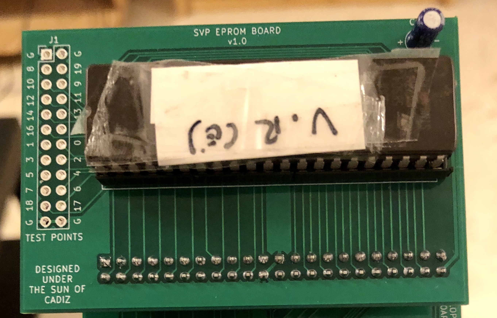

# SVP EPROM board

This board attaches to the [SVP adapter board](../svp-adapter-board) and allows feeding code to the SVP from a 27C160 EPROM (or probably from any pin-compatible EEPROM like the MX29F1615PC-10 by Macronix - not tested).

Designed with KiCAD 5.1.

## Components

Even though the board is just rewiring the original ROM pins in the cartridge to the pinout of the EPROM, I added the following passive devices for good measure:

- 1x 4.7uf electrolytic capacitor.
- 1x 0.1uf (0603 package) SMD ceramic capacitor.
- 1x 0ohm resistor (1206 package).
- 1x DIP42 socket.
- 1x 44-pin header male connector (2.54mm pitch).
- Test points (optional).

I guess the bypass capacitors could be optional but the resistor is required. Anyway these are chip and not that hard to solder so please use them :).

Regarding the DIP42 socket, if you can't find these in your area just using a couple of smaller sockets (i.e.: two DIP24 sockets and cutting the extra pins from one of them) should do the trick.

There's also connectors for test pins. You probably don't need to do anything with these, but I plan to use them to measure access speeds from the SVP with my oscilloscope. But the EPROM will work just fine without them in the board.

## EPROM speeds

From what can be seen in Virtua Racing prototype boards, the SVP was meant to be used with ROMs with an access speed of 120ns or faster. The EPROMs that I used with these (27C160-100) have an access time of 100ns and they ran Virtua Racing without issues.

## Manufacturing

Any PCB manufacturer for hobbyists should be able to build this board.

## Mounting

There's not much to this board really. Just be careful with the bigger bypass capacitor polarity, and placing the EPROM in the right position.

## License

The designs for these boards is open source and MIT-licensed. Also take into account the following conditions of use:

* Please use these tools for good. Also for fun. But good fun, not evil fun.
* Messing with real hardware is risky. By using these boards you are responsible for any potential issues you might find while using these designs.
* If you build something really cool (moderately cool also works for me) using these boards please drop a comment at `taiyou[at]gmail.com`.
* You're not forced, but if you use these boards in your own projects I'd appreciate if you could acknowledge me :).

## "Designed under the sun of Cadiz"

You'll find that most of my boards here have this text somewhere in their layout. I was born in [Cádiz](https://en.wikipedia.org/wiki/C%C3%A1diz), the southernmost city in Spain (and the oldest city in Western Europe). It's not a city that's usually associated to technology or these kind of projects so for me it's really important that *cool* things some of us do here related to tech are considered as part of the legacy of this town too. These designs are open source so you're free to modify them at your will, but I'd ask you kindly not to remove this label if you will. Please help us to spread the name of our wonderful city all around the tech world!